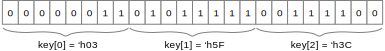

## Background

The circuit is an ARC4 decryption circuit. [ARC4](https://en.wikipedia.org/wiki/RC4) is a symmetric stream cipher, and was once widely used in encrypting web traffic, wireless data, and so on; it has since been broken. Still, the structure of ARC4 is similar to modern symmetric encryption methods, and provides a good vehicle for studying digital circuits that make extensive use of on-chip memory.

### ARC4 Decryption

This section describes the ARC4 cipher. A stream cipher like ARC4 uses the provided encryption key to generate a pseudo-random byte stream that is xor'd with the plaintext to obtain the ciphertext. Because xor is symmetric, encryption and decryption are exactly the same.

The basic ARC4 algorithm uses the following parameters:

| Parameter | Type | Semantics |
| --- | --- | --- |
| `key[]` | input | array of bytes that represent the secret key (24 bits in our implementation) |
| `ciphertext[]` | input | array of bytes that represent the encrypted message |
| `plaintext[]` | output | array of bytes that represent the decrypted result (same length as ciphertext) |

and proceeds as shown in this pseudocode:

    -- key-scheduling algorithm: initialize the s array
    for i = 0 to 255:
        s[i] = i
    j = 0
    for i = 0 to 255:
        j = (j + s[i] + key[i mod keylength]) mod 256  -- for us, keylength is 3
        swap values of s[i] and s[j]

    -- pseudo-random generation algorithm: generate byte stream (“pad”) to be xor'd with the ciphertext
    i = 0, j = 0
    for k = 0 to message_length-1:
        i = (i+1) mod 256
        j = (j+s[i]) mod 256
        swap values of s[i] and s[j]
        pad[k] = s[(s[i]+s[j]) mod 256]

    -- ciphertext xor pad --> plaintext
    for k = 0 to message_length-1:
        plaintext[k] = pad[k] xor ciphertext[k]  -- xor each byte

Note that the key is stored [big-endian](https://en.wikipedia.org/wiki/Endianness). The following diagram shows the values of key[0], key[1], and key[2] for the 24-bit secret key of 'b000000110101111100111100 = 'h035F3C.

### Task 1: ARC4 state initialization

Implementation of the first step of ARC4, where the cipher state S is initialized to [0..255]:

    for i = 0 to 255:
        s[i] = i
        

### Task 2: The Key-Scheduling Algorithm

Many symmetric ciphers, including ARC4, have a phase called the _Key-Scheduling Algorithm_ (KSA). The objective of the KSA is to spread the key entropy evenly across _S_ to prevent statistical correlations in the generated ciphertext that could be used to break the cipher. ARC4 does this by swapping values of _S_ at various indices:

    j = 0
    for i = 0 to 255:
        j = (j + s[i] + key[i mod keylength]) mod 256   -- for us, keylength is 3
        swap values of s[i] and s[j]

### Task 3: The Pseudo-Random Generation Algorithm

The final phase of ARC4 generates the bytestream that is then xor'd with the input plaintext to encrypt the message, or, as in our case, with the input ciphertext to decrypt it. We don't need the bytestream by itself, so in this task we will combine both.

    i = 0, j = 0
    for k = 0 to message_length-1:
        i = (i+1) mod 256
        j = (j+s[i]) mod 256
        swap values of s[i] and s[j]
        pad[k] = s[(s[i]+s[j]) mod 256]

    for k = 0 to message_length-1:
        plaintext[k] = pad[k] xor ciphertext[k]  -- xor each byte

### Task 4: Cracking ARC4
